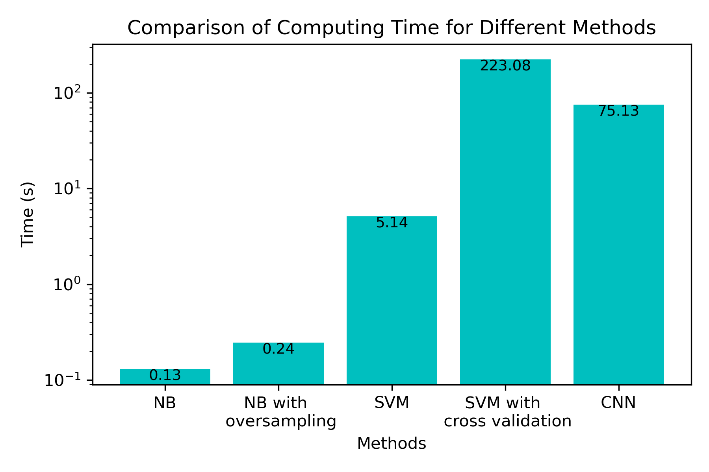
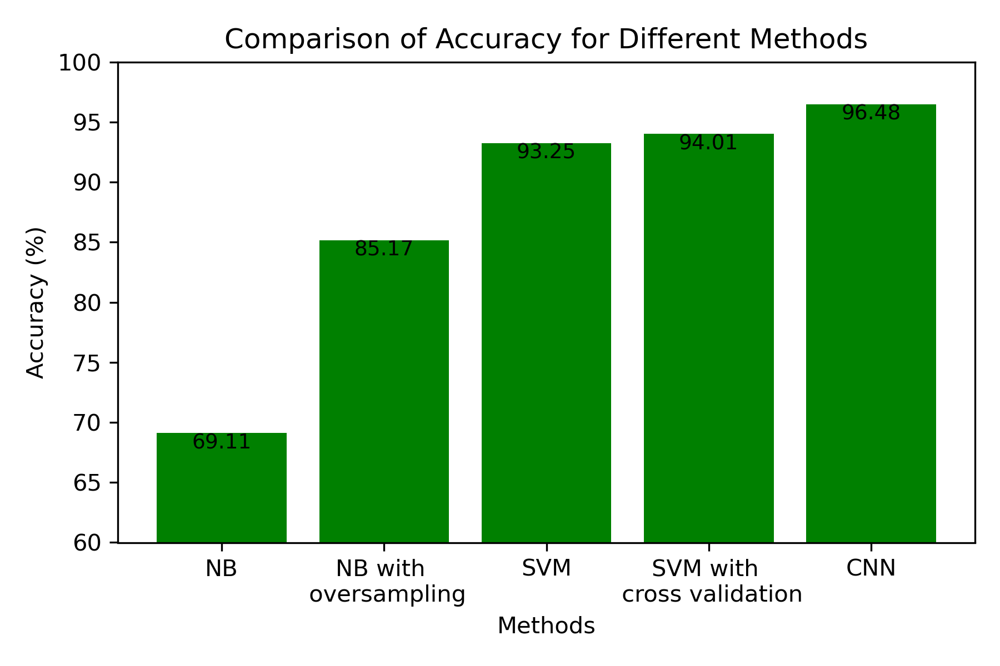

# Introduction

Weed image classification is an important task in precision agriculture, which aims to improve farming practices by using advanced technologies and data-driven decision-making. The main objective of weed image classification is to distinguish between weed and crop plants in images taken from agricultural fields. By accurately identifying weed species and their locations, farmers can take targeted actions to control weed growth, leading to improved crop yields and reduced usage of herbicides. When it comes to binary classification, we can use supervised learning like Navie Bayes (NB), support vector machine (SVM) and convolutional neuron network (CNN). In order to implement to real-world tasks, inference time, computing cost and accuracy are important to be consider determining which the methods are most suitable to be used. Thus, in this project, we experimentally present which of the binary classification supervised learning methods (NB, SVM, or CNN) performs better in terms of accuracy and computing time for weed detection in soybean crops.

> Distinguish between weed and crop plants in images taken from agricultural fields.
> Control weed growth, improve crop yields and reduce usage of herbicides.
> Compare the computing time and accuracy between the methods of NB, SVM, and CNN.

_All experiments are conducted in Python and run on a laptop with four 2.4 GHz cores and 16 GB of RAM._

# Workflow

To fulfill this project, we can follow the following steps:

- Data preparation:
  - Download the dataset from Kaggle ([Link](https://www.kaggle.com/datasets/fpeccia/weed-detection-in-soybean-crops))
  - Rearrange the number of images for weed and non-weed into 260 and 5000, respectively.
  - Import the necessary packages.
  - Preprocess the data by resizing images, normalizing pixel values, and formatting the data type (for example, squeeze the dimension) in order to input the model. We use NumPy array as input for NB and SVM, and Tensor for CNN.
  - Split the dataset into training, and test sets with the sizes of 0.8 and 0.2, respectively.

```python
# Import the necessary packages.

import numpy as np
import cv2
import os
import glob
import time

from sklearn.model_selection import train_test_split, GridSearchCV
from sklearn.naive_bayes import GaussianNB
from sklearn.svm import SVC, LinearSVC
from sklearn.preprocessing import StandardScaler
from sklearn.decomposition import PCA
from sklearn.pipeline import make_pipeline
from sklearn.metrics import accuracy_score, confusion_matrix, classification_report

from imblearn.over_sampling import SMOTE, RandomOverSampler
from imblearn.under_sampling import RandomUnderSampler
from imblearn.pipeline import Pipeline

import torch
import torch.nn as nn
import torch.optim as optim
import torch.nn.functional as F
from torchvision import models
from torch.utils.data import Dataset, DataLoader
```

```python
# Preprocess the data by resizing images, normalizing pixel values, and formatting the data type

def load_images(path, label):
    images = []
    labels = []
    for img_path in glob.glob(os.path.join(path, "*.tif")):
        img = cv2.imread(img_path, cv2.IMREAD_GRAYSCALE)
        img = cv2.resize(img, (64, 64))
        images.append(img)
        labels.append(label)
    return images, labels

def run(method, sampling=0, crossvalidation=0, optm="SGD"):

    weed_images, weed_labels = load_images("weed", 1)
    non_weed_images, non_weed_labels = load_images("non_weed", 0)
    all_images = np.array(weed_images + non_weed_images)
    all_labels = np.array(weed_labels + non_weed_labels)

    X_train, X_test, y_train, y_test = train_test_split(all_images, all_labels, test_size=0.2, random_state=42)

    if method == "nb":
        start_time = time.time()
        X_train = X_train.reshape(X_train.shape[0], -1)
        X_test = X_test.reshape(X_test.shape[0], -1)
        if sampling != 0:
            resampling = Pipeline([('oversample', SMOTE()), ('undersample', RandomUnderSampler())])
            X_train, y_train = resampling.fit_resample(X_train, y_train)
        mtd = GaussianNB()
        mtd.fit(X_train, y_train)
        y_pred = mtd.predict(X_test)
        end_time = time.time()
        elapsed_time = end_time - start_time
        acc = accuracy_score(y_test, y_pred)

    elif method == "svm":
        start_time = time.time()
        X_train = X_train.reshape(X_train.shape[0], -1)
        X_test = X_test.reshape(X_test.shape[0], -1)
        scaler = StandardScaler()
        X_train_scaled = scaler.fit_transform(X_train)
        X_test_scaled = scaler.transform(X_test)
        if crossvalidation != 0:
            param_grid = {'C': [0.1, 1, 10], 'gamma': [1, 0.1, 0.01], 'kernel': ['linear', 'rbf']}
            mtd = GridSearchCV(SVC(), param_grid, cv=2, verbose=2)
            mtd.fit(X_train_scaled, y_train)
            best_svm = mtd.best_estimator_
            y_pred = best_svm.predict(X_test_scaled)
        else:
            mtd = SVC(kernel='linear', C=1, gamma=0.1)
            mtd.fit(X_train_scaled, y_train)
            y_pred = mtd.predict(X_test_scaled)
            
        acc = accuracy_score(y_test, y_pred)
        end_time = time.time()
        elapsed_time = end_time - start_time
    
    elif method == "cnn":
        acc, elapsed_time = cnn(X_train, X_test, y_train, y_test, optm)
    
    return acc, elapsed_time
```

```python
# Build the Convolutional Neuronal Network

class WeedDataset(Dataset):
    def __init__(self, data, labels):
        self.data = data
        self.labels = labels

    def __len__(self):
        return len(self.data)

    def __getitem__(self, index):
        img = self.data[index]
        img = torch.from_numpy(img).unsqueeze(0).float() / 255.0
        label = self.labels[index]
        return img, label

class BinaryClassifier(nn.Module):
    def __init__(self):
        super(BinaryClassifier, self).__init__()
        self.conv1 = nn.Conv2d(1, 16, 3, padding=1)
        self.conv2 = nn.Conv2d(16, 32, 3, padding=1)
        self.pool = nn.MaxPool2d(2, 2)
        self.fc1 = nn.Linear(32 * 16 * 16, 256)
        self.fc2 = nn.Linear(256, 1)
        self.sigmoid = nn.Sigmoid()

    def forward(self, x):
        x = self.pool(F.relu(self.conv1(x)))
        x = self.pool(F.relu(self.conv2(x)))
        x = x.view(-1, 32 * 16 * 16)
        x = F.relu(self.fc1(x))
        x = self.fc2(x)
        x = self.sigmoid(x)
        return x

def cnn(X_train, X_test, y_train, y_test, optm="SGD"):
    train_dataset = WeedDataset(X_train, y_train)
    test_dataset = WeedDataset(X_test, y_test)
    train_loader = DataLoader(train_dataset, batch_size=32, shuffle=True)
    test_loader = DataLoader(test_dataset, batch_size=32, shuffle=False)

    device = torch.device("cuda" if torch.cuda.is_available() else "cpu")

    model = BinaryClassifier().to(device)
    criterion = nn.BCELoss()
    optimizer = optim.SGD(model.parameters(), lr=0.01, momentum=0.9)

    num_epochs = 30
    start_time = time.time()
    for epoch in range(num_epochs):
        model.train()
        running_loss = 0.0
        for images, labels in train_loader:
            images = images.to(device, dtype=torch.float)
            labels = labels.to(device, dtype=torch.float).view(-1, 1)
            optimizer.zero_grad()
            outputs = model(images)
            loss = criterion(outputs, labels)
            loss.backward()
            optimizer.step()
            running_loss += loss.item()
            # print(f"Epoch {epoch+1}/{num_epochs}, Loss: {running_loss/len(train_loader)}")
    end_time = time.time()
    elapsed_time = end_time - start_time
    
    model.eval()
    correct = 0
    total = 0
    with torch.no_grad():
        for images, labels in test_loader:
            images = images.to(device, dtype=torch.float)
            labels = labels.to(device, dtype=torch.float).view(-1, 1)
            
            outputs = model(images)
            predicted = (outputs > 0.5).float()
            total += labels.size(0)
            correct += (predicted == labels).sum().item()
    acc_cnn = correct / total
    return acc_cnn, elapsed_time
```

# Execute the code

```python
acc_nb, elapsed_time_nb = run("nb")
acc_nb_os, elapsed_time_nb_os = run("nb", sampling=1)
acc_svm, elapsed_time_svm = run("svm")
acc_svm_cv, elapsed_time_svm_cv = run("svm", crossvalidation=1)
acc_cnn, elapsed_time_cnn = run("cnn")
```

# Results

```python
# Visualize the reults

import matplotlib.pyplot as plt

methods = ['NB', 'NB with \n oversampling', 'SVM', 'SVM with \n cross validation', 'CNN']
accuracies = np.array([acc_nb, acc_nb_os, acc_svm, acc_svm_cv, acc_cnn]) *100
times = np.array([elapsed_time_nb, elapsed_time_nb_os, elapsed_time_svm, elapsed_time_svm_cv, elapsed_time_cnn])

def add_value_labels(bs):
    for bar in bs:
        height = bar.get_height()
        plt.text(bar.get_x()+bar.get_width()/2,height,f'{height:.2f}',ha='center',va='top',fontsize=9)

bar_acc = plt.bar(methods, accuracies, color='g')
plt.yscale('linear')
plt.ylim([60,100])
plt.xlabel('Methods')
plt.ylabel('Accuracy (%)')
plt.title('Comparison of Accuracy for Different Methods')
add_value_labels(bar_acc)
plt.tight_layout()
plt.savefig('acc.png', dpi=300)
plt.show()

bar_time = plt.bar(methods, times, color='c')
plt.yscale('log')
plt.xlabel('Methods')
plt.ylabel('Time (s)')
plt.title('Comparison of Computing Time for Different Methods')
add_value_labels(bar_time)
plt.tight_layout()
plt.savefig('time.png', dpi=300)
plt.show()
```





Text can be **bold**, _italic_, or ~~strikethrough~~.

[Link to another page](./another-page.html).

There should be whitespace between paragraphs.

There should be whitespace between paragraphs. We recommend including a README, or a file with information about your project.

# Header 1

This is a normal paragraph following a header. GitHub is a code hosting platform for version control and collaboration. It lets you and others work together on projects from anywhere.

## Header 2

> This is a blockquote following a header.
>
> When something is important enough, you do it even if the odds are not in your favor.

### Header 3

```js
// Javascript code with syntax highlighting.
var fun = function lang(l) {
  dateformat.i18n = require('./lang/' + l)
  return true;
}
```

```ruby
# Ruby code with syntax highlighting
GitHubPages::Dependencies.gems.each do |gem, version|
  s.add_dependency(gem, "= #{version}")
end
```

#### Header 4

*   This is an unordered list following a header.
*   This is an unordered list following a header.
*   This is an unordered list following a header.

##### Header 5

1.  This is an ordered list following a header.
2.  This is an ordered list following a header.
3.  This is an ordered list following a header.

###### Header 6

| head1        | head two          | three |
|:-------------|:------------------|:------|
| ok           | good swedish fish | nice  |
| out of stock | good and plenty   | nice  |
| ok           | good `oreos`      | hmm   |
| ok           | good `zoute` drop | yumm  |

### There's a horizontal rule below this.

* * *

### Here is an unordered list:

*   Item foo
*   Item bar
*   Item baz
*   Item zip

### And an ordered list:

1.  Item one
1.  Item two
1.  Item three
1.  Item four

### And a nested list:

- level 1 item
  - level 2 item
  - level 2 item
    - level 3 item
    - level 3 item
- level 1 item
  - level 2 item
  - level 2 item
  - level 2 item
- level 1 item
  - level 2 item
  - level 2 item
- level 1 item

### Small image


### Large image


### Definition lists can be used with HTML syntax.

<dl>
<dt>Name</dt>
<dd>Godzilla</dd>
<dt>Born</dt>
<dd>1952</dd>
<dt>Birthplace</dt>
<dd>Japan</dd>
<dt>Color</dt>
<dd>Green</dd>
</dl>

```
Long, single-line code blocks should not wrap. They should horizontally scroll if they are too long. This line should be long enough to demonstrate this.
```

```
The final element.
```
